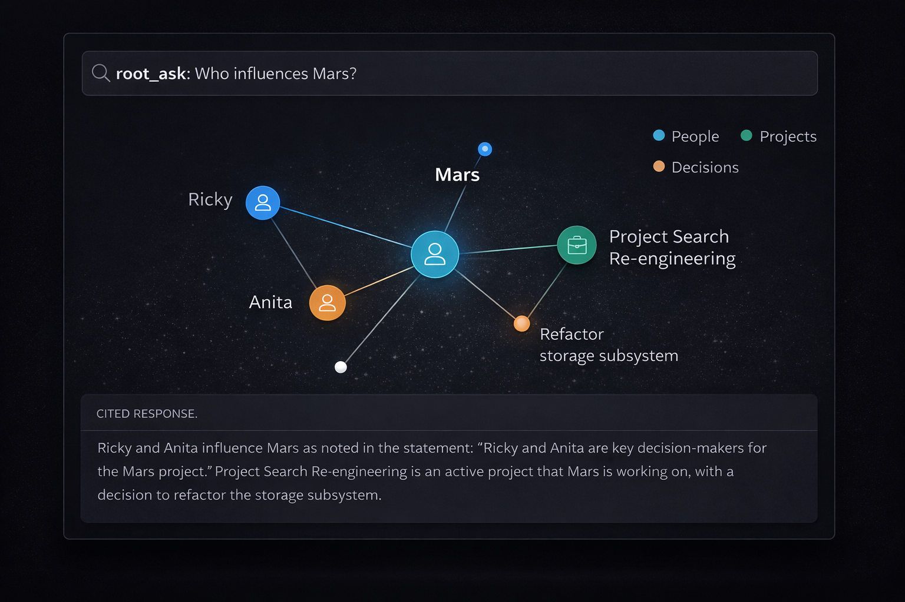
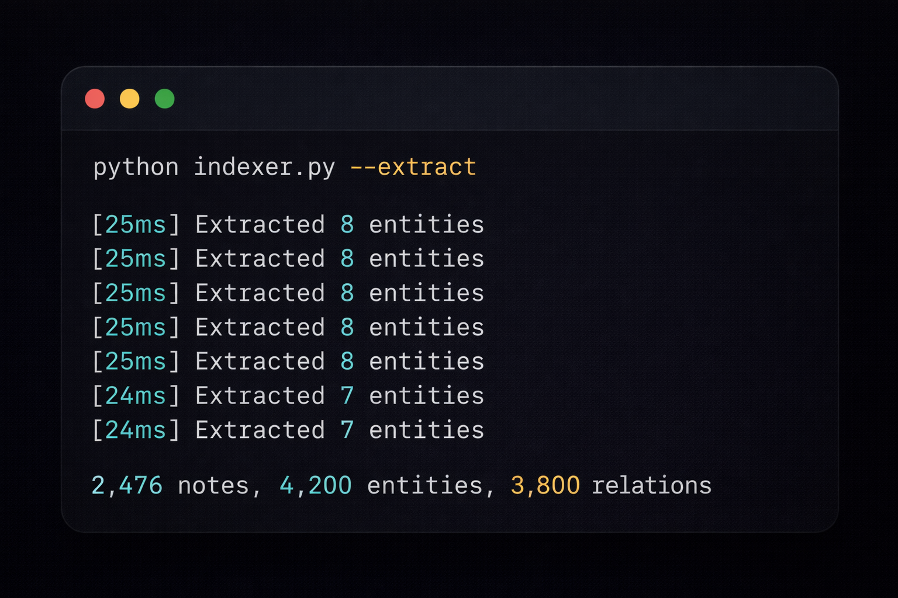
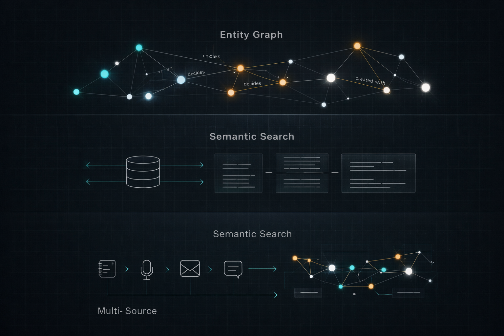

<p align="center">
  
  
  
  
  
</p>

<h1 align="center">ROOT</h1>

<p align="center">
  <strong>Ask questions across all your knowledge. Get cited answers.</strong><br>
  Turn your Obsidian vault, meeting notes, and emails into a queryable intelligence layer.
</p>

<p align="center">
  
</p>

<p align="center">
  <a href="#what-you-can-ask-root">What You Can Ask</a> &bull;
  <a href="#how-it-works">How It Works</a> &bull;
  <a href="#quick-start">Quick Start</a> &bull;
  <a href="#18-mcp-tools">Tools</a> &bull;
  <a href="#running-costs">Running Costs</a> &bull;
  <a href="#comparison">Comparison</a>
</p>

---

You wrote it down. You know you did. It was in a meeting note, or maybe a Slack thread you copied into Obsidian, or that document you made before the planning session. But now you're searching and finding nothing, or finding five things that contradict each other, and you're holding the whole mental model in your head again.

ROOT fixes this. It connects your notes, meetings, and emails into a single queryable layer — one you can ask questions in plain English, the same way you'd ask a colleague who'd read everything you've ever written.

```
> root_ask("What decisions were made about FoS Simplification?")

# ROOT Answer

Leadership APPROVED the FoS Simplification project on March 17, 2026.
The FOS list was locked and finalized at the kick-off meeting on March 23.
Scope: consolidate 1,541 field of studies down to 131 across 16 groups,
based on Times Higher Education framework. Owner: Sadia Hamid (coordinator),
Marco/Simon (engineering). Sprint start: April 7.

*Based on 5 search results and 2 entity matches.*
```

That answer came from five different notes and two separate meetings. No manual searching. No context-switching. ROOT found the thread, traced the decisions, and told you what happened.

---

## What You Can Ask ROOT

ROOT is built for the questions that currently require you to open six tabs and reconstruct things from memory:

- "What did I commit to Ric last week?"
- "How did the pricing decision evolve over the last month?"
- "Who has been working on Project X, and through what?"
- "What did the team decide about the API design, and did it change?"
- "What action items from last quarter are still open?"
- "Brief me on this person before my 1:1 — everything we've discussed."

You ask in plain English. ROOT synthesizes an answer with citations from every source it has indexed.

---

## What Makes It Different From Searching Obsidian

| Obsidian search | ROOT |
|----------------|------|
| Keyword matching | Semantic understanding ("lead decline" finds "traffic drop" notes) |
| Shows files | Shows synthesized answers with citations |
| No entity awareness | Knows people, projects, decisions as first-class objects |
| No cross-source | Combines vault + meetings + emails + Slack |
| Manual navigation | Traverses relationship graph automatically |
| One note at a time | Aggregates across hundreds of notes per query |

ROOT knows that "Sadia" from the kick-off meeting is the same "Sadia Hamid" from the planning session. It knows she is connected to "Simon" via an implementation dependency. You can traverse these connections across hundreds of notes without opening a single file.

---

## Quick Start

<p align="center">
  
</p>

```bash
# Clone and setup
git clone https://github.com/mshadmanrahman/root-kg.git
cd root-kg
python -m venv .venv && source .venv/bin/activate
pip install -e .

# Interactive setup wizard
python -m root init

# Index your notes (~2 min for 2,500 notes)
python indexer.py

# Extract entities (~$3 on Anthropic Haiku, or free with Ollama)
python indexer.py --extract

# Register as MCP server in Claude Code
claude mcp add root -- python server.py

# Try it
# root_search("your topic")
# root_ask("your question")
# root_graph("person name", 2)
```

> ROOT connects to Claude Code as an MCP server. New to Claude Code? [claudecodeguide.dev](https://claudecodeguide.dev) gets you set up in under an hour.

---

## Running Costs

This is almost free to run. The initial setup costs a few dollars. After that, daily operation runs in the pennies — because ROOT only reprocesses notes that have actually changed.

| Activity | Frequency | Cost |
|----------|-----------|------|
| Initial vault index (embeddings) | Once | $0 (local model) |
| Initial entity extraction | Once (~2,500 notes) | ~$3-5 (Haiku) or $0 (Ollama) |
| Incremental re-index | Every 2 hours | $0 (local) |
| Incremental extraction | Every 2 hours, only changed notes | ~$0.01-0.05/day |
| Queries via root_ask | On-demand | ~$0.01/query (Sonnet) |
| **Monthly estimate** | | **$1-3** |

Compare that to Mem.ai ($20/mo) or Rewind ($20/mo) — both cloud-only, both proprietary. ROOT runs locally, costs a latte per month, and your data never leaves your machine unless you choose a cloud LLM for synthesis.

---

## How It Works

ROOT has a four-step pipeline: ingest, embed, extract, query.

<p align="center">
  
</p>

```
┌──────────────────────────────────────────────────────────────┐
│                      DATA SOURCES                             │
│                                                               │
│  Obsidian Vault        meetings (Granola)        emails       │
│  2,500+ notes          auto or manual            Gmail MCP    │
│  auto every 2h         via root_ingest           via ingest   │
└──────────────┬───────────────┬───────────────┬───────────────┘
               │               │               │
               ▼               ▼               ▼
┌──────────────────────────────────────────────────────────────┐
│           STEP 1: INDEXING (free, runs locally)               │
│                                                               │
│  Content hashing (SHA-256) for incremental updates            │
│  Markdown-aware chunking (splits on headings)                 │
│  Local embeddings: all-MiniLM-L6-v2 (384 dims, CPU)          │
│  Stored in SQLite + sqlite-vec                                │
│                                                               │
│  Cost: $0. No API calls. ~2 min for 2,500 notes.             │
└──────────────┬───────────────────────────────────────────────┘
               │
               ▼
┌──────────────────────────────────────────────────────────────┐
│           STEP 2: ENTITY EXTRACTION (pennies/day)             │
│                                                               │
│  For each new/changed note, an LLM extracts:                  │
│                                                               │
│  Entities: people, projects, decisions, events,               │
│            concepts, organizations                            │
│  Relations: works_with, owns, decided, discussed,             │
│             blocked_by, depends_on, manages, etc.             │
│  Confidence: 0.9+ explicit, 0.7 implied, 0.5 weak signals    │
│  Aliases: "Fredrik" = "Frederick", "FoS" = "Field of Study"  │
│                                                               │
│  Model: Claude Haiku (~$0.003 per note)                       │
│  Daily cost: pennies (only changed notes reprocessed)         │
└──────────────┬───────────────────────────────────────────────┘
               │
               ▼
┌──────────────────────────────────────────────────────────────┐
│           STEP 3: KNOWLEDGE GRAPH (stored in SQLite)          │
│                                                               │
│  ┌───────────┐     ┌────────────┐     ┌────────────┐        │
│  │ entities  │────▶│ relations  │◀────│  aliases   │        │
│  │  13,000+  │     │  20,000+   │     │   8,000+   │        │
│  └───────────┘     └────────────┘     └────────────┘        │
│       │                                                       │
│       ▼                                                       │
│  ┌──────────────┐   ┌───────────────┐                        │
│  │ entity-note  │   │    notes      │                        │
│  │   links      │   │ with chunks   │                        │
│  │  28,000+     │   │  & embeddings │                        │
│  └──────────────┘   └───────────────┘                        │
│                                                               │
│  Graph traversal via recursive CTEs. <10ms at depth 2.        │
│  Everything in one SQLite file. No Postgres, no Neo4j.        │
└──────────────┬───────────────────────────────────────────────┘
               │
               ▼
┌──────────────────────────────────────────────────────────────┐
│           STEP 4: QUERY (on demand, via MCP)                  │
│                                                               │
│  root_ask combines all three layers:                          │
│  1. Semantic search finds the 5 most relevant chunks          │
│  2. Entity graph pulls the neighborhood of mentioned entities │
│  3. Claude Sonnet synthesizes a cited, natural language answer │
│                                                               │
│  This consistently outperforms pure vector search for         │
│  multi-hop questions ("Who decided X and what happened next?")│
│                                                               │
│  Cost: ~$0.01 per query                                       │
└──────────────────────────────────────────────────────────────┘
```

### The Two-Model Strategy

- **Haiku** ($0.80/$4 per MTok): bulk extraction. Runs on every note, cheap enough to process thousands.
- **Sonnet** ($3/$15 per MTok): synthesis. Only runs when you ask a question. Higher quality reasoning for connecting dots.

Embeddings are always free and local. Only entity extraction and `root_ask` use the LLM.

---

## 18 MCP Tools

### Search & Discovery
```
root_search(query)              Semantic search across all notes
root_search_folder(query, dir)  Search within a specific folder
root_note(path)                 Read full note content
root_stats()                    Index health and statistics
root_connections(path)          Cross-domain connections for a note
root_themes(scope)              Recurring themes via clustering
root_gaps(topic)                Knowledge gaps and blind spots
```

### Multi-Source Intelligence
```
root_ingest(source, title, content)  Ingest from any MCP source
root_ingest_batch(items)             Batch ingest
root_about(person)                   Everything about a person
root_open_loops(scope)               Unfollowed action items
root_project_pulse(project)          Activity pulse for a project
```

### Entity Graph & GraphRAG
```
root_graph(entity, depth)       Entity neighborhood traversal
root_influence_map(project)     Who touched this project, through what
root_decision_trail(topic)      How decisions evolved over time
root_blind_spots()              Entities with declining activity
root_ask(question)              Free-form Q&A (GraphRAG)
root_weekly_digest()            Weekly activity summary
```

---

## Use Cases

### For Product Managers
- **"Who influences Project X?"** `root_influence_map("Project X")` shows every stakeholder, their role, and evidence from meetings and notes
- **"What decisions were made about pricing?"** `root_decision_trail("pricing")` traces the chronological evolution
- **"What did I promise Ric last week?"** `root_open_loops("Ric")` surfaces unfollowed action items
- **"Brief me before my 1:1"** `root_about("colleague name")` pulls everything across all sources

### For Engineers
- **"How does the auth system work?"** `root_ask("authentication architecture")` synthesizes from architecture docs, meeting notes, and ADRs
- **"What depends on this service?"** `root_graph("service name", 2)` shows the dependency graph
- **"What's gone stale?"** `root_blind_spots()` finds topics that were hot but went silent

### For Researchers & Writers
- **"What themes connect my notes?"** `root_themes()` discovers patterns via clustering
- **"What am I missing about this topic?"** `root_gaps("your topic")` finds blind spots
- **"Connect the dots"** `root_connections("note path")` finds unexpected cross-domain links

### For Teams
- **"Weekly knowledge pulse"** `root_weekly_digest()` summarizes what changed across all sources
- **"Project health check"** `root_project_pulse("project")` shows activity across notes, meetings, and email

---

## LLM Backends

Three backends for entity extraction and Q&A synthesis:

| Backend | Cost | Quality | Setup |
|---------|------|---------|-------|
| **Anthropic** (default) | ~$3-5 per 2,500 notes | Best | `ANTHROPIC_API_KEY` in `.env` |
| **OpenRouter** | Free $1 credit to start | Good | `OPENROUTER_API_KEY` in `.env` |
| **Ollama** | Free (runs locally) | Lower | `ollama pull llama3.1` |

Set in `config.yaml`:
```yaml
llm:
  backend: "anthropic"  # or "openrouter" or "ollama"
```

---

## Auto-Refresh

ROOT supports automatic re-indexing so your knowledge graph stays fresh.

### macOS (recommended: cron)

Cron is recommended over launchd because macOS TCC restrictions prevent launchd agents from accessing `~/Documents` and iCloud paths.

```bash
# Add to crontab (runs every 2 hours at :30)
crontab -e

# Add this line:
30 8,10,12,14,16,18,20,22 * * * ANTHROPIC_API_KEY=your-key-here /path/to/root-kg/.venv/bin/python /path/to/root-kg/indexer.py --extract >> ~/Library/Logs/root-indexer.log 2>> ~/Library/Logs/root-indexer.err
```

Only changed notes are reprocessed. Typical incremental run: <30 seconds, costing fractions of a cent.

**Pro tip:** If you use Granola for meeting notes with an Obsidian sync, offset ROOT's cron by 30 minutes so fresh meeting content is in the vault when ROOT indexes.

### macOS (alternative: launchd)

A `launchd` plist is included but has limitations with iCloud vault paths due to macOS TCC. If your vault is outside `~/Documents` and iCloud, it works fine:

```bash
# Edit com.shadman.root-refresh.plist: replace ROOT_DIR with your path
cp com.shadman.root-refresh.plist ~/Library/LaunchAgents/
launchctl load ~/Library/LaunchAgents/com.shadman.root-refresh.plist
```

### Linux (systemd timer)

Community contribution welcome. The equivalent would be a systemd timer running `python indexer.py --extract` on a schedule.

---

## Architecture

```
root-kg/
├── server.py           # MCP server (18 tools, stdio transport)
├── db.py               # SQLite + sqlite-vec + entity graph
├── embeddings.py       # Local embedding model (free, CPU)
├── llm.py              # Multi-backend LLM (zero pip deps, stdlib urllib)
├── extractor.py        # Incremental entity extraction pipeline
├── indexer.py           # Vault indexer + extraction orchestrator
├── cli.py              # Setup wizard (python -m root init)
├── chunker.py          # Markdown-aware note splitter
├── run-indexer.sh      # Wrapper script for cron/launchd
├── tools/
│   ├── search.py       # Semantic search
│   ├── patterns.py     # Themes, connections, gaps
│   ├── correlations.py # About, open loops, pulse
│   ├── graph.py        # Entity graph, influence map, decision trail
│   └── intelligence.py # root_ask (GraphRAG), weekly digest
├── adapters/
│   └── vault.py        # Obsidian vault scanner
├── config.example.yaml # Template config
├── .env.example        # Template env
└── data/root.db        # Everything in one file (gitignored)
```

**Design principles:**
- **Single file database.** No Postgres, no Neo4j, no Docker. One SQLite file.
- **Zero new pip deps for LLM.** Uses stdlib `urllib` for API calls. No `anthropic` or `openai` SDK.
- **Incremental everything.** SHA-256 content hashing for both indexing and extraction. Only changed notes are reprocessed.
- **Safety guards.** If the vault scan returns 0 results but the DB has existing notes, the indexer aborts instead of purging. Prevents data loss from permission issues or inaccessible paths.
- **Immutable data patterns.** All functions return new data, never mutate inputs.
- **Graph on SQLite.** Recursive CTEs for traversal. <10ms at depth 2 with thousands of entities.

---

## Comparison

| Feature | ROOT | Obsidian Graph | Mem.ai | Khoj | Rewind |
|---------|------|----------------|--------|------|--------|
| Entity extraction | LLM-powered | None | None | None | None |
| Typed relations | Yes (10 types) | Backlinks only | No | No | No |
| GraphRAG | Yes | No | Basic RAG | Basic RAG | No |
| Multi-source | Notes+meetings+email | Notes only | Yes | Notes only | Everything |
| MCP native | Yes | No | No | No | No |
| Self-hosted | Yes | Yes | No | Yes | No |
| Single file DB | Yes | N/A | Cloud | Postgres | Cloud |
| Free embeddings | Yes (local) | N/A | No | Yes | No |
| Privacy | 100% local | 100% local | Cloud | Hybrid | Cloud |
| Cost | ~$3 one-time + $1-3/mo | Free | $20/mo | Free* | $20/mo |

---

## Requirements

- Python 3.11+
- ~500MB disk for embeddings model (downloaded on first run)
- One of: Anthropic API key (~$5 to start), OpenRouter key (free $1 credit), or Ollama (free, local)

## Contributing

PRs welcome. The codebase is intentionally simple: Python 3.11+, no frameworks, small files (<400 lines each).

Areas that would benefit from contributions:
- **Adapters**: LogSeq, Notion, Apple Notes, Google Docs
- **Backends**: Google Gemini, local models via llama.cpp
- **Visualization**: Web UI for entity graph exploration
- **Platforms**: Linux systemd timer, Windows Task Scheduler

## License

MIT

---

## Part of the PM Toolkit Family

ROOT is one of several tools built for PMs and knowledge workers who want AI that works with their actual context.

**[pm-pilot](https://github.com/mshadmanrahman/pm-pilot)** — Claude Code configured for PMs. Meeting prep, PRDs, market sizing — 25 skills, ready to install.

**[bug-shepherd](https://github.com/mshadmanrahman/bug-shepherd)** — Zero-code bug triage for PMs. Reproduce and sync bugs without reading a line of code.

**[morning-digest](https://github.com/mshadmanrahman/morning-digest)** — Your morning briefed in 30 seconds. Calendar, email, Slack, and action items in one digest.

**[claudecode-guide](https://github.com/mshadmanrahman/claudecode-guide)** — The friendly guide to Claude Code. Zero jargon — from first install to daily operating system. Also at [claudecodeguide.dev](https://claudecodeguide.dev).

---

<p align="center">
  Built by <a href="https://github.com/mshadmanrahman">Shadman Rahman</a>
</p>
